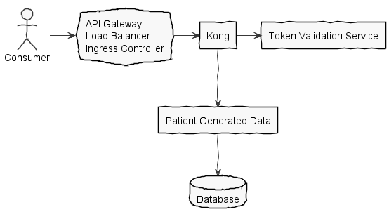

# health-apis-patient-generated-data

A [Spring Boot](https://spring.io/projects/spring-boot) application that provides
basic read and write operations for [FHIR R4](https://hl7.org/fhir/R4/)
compliant resources.

## System Components

The API Gateway handles authentication and rate limiting before traffic is received by Patient Generated Data.

- **Kong** is responsible for token validation and SMART-on-FHIR OAuth scope enforcement
- **Patient Generated Data** the underlying application that processes the requests
- **Database** is an AWS database instance for persistence

## Modules

- [patient-generated-data](patient-generated-data/README.md) - Main API implementation
- [patient-generated-data-synthetic](patient-generated-data-synthetic/README.md) - Database instance for local development and integration tests
- [patient-generated-data-tests](patient-generated-data-tests/README.md) - Integration tests

## Local Development

Refer to [health-apis-parent](https://github.com/department-of-veterans-affairs/health-apis-parent)
for basic environment setup. (Java, Maven, Docker, etc.)
Execute `mvn clean install` to build all of the modules, then follow the local development
instructions for the [local database](patient-generated-data-synthetic/README.md#local-development)
and the [main application](patient-generated-data/README.md#local-development).
