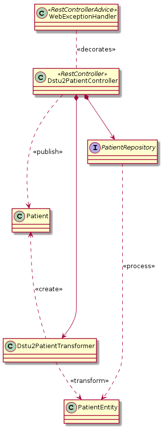

# Data Query

Spring Boot implementation of the
[FHIR Argonaut Data Query specification](http://www.fhir.org/guides/argonaut/r2/profiles.html),
as well as supporting resources for [FHIR STU3 resources](http://www.hl7.org/fhir/STU3/).

## Design
Data-query is implemented as a series of resource-specific components the follow the template below.
To make the description more complete, the pattern is shown for _Dstu2Patient_, but it is replicated
for each resource.

##### Components

- `WebExceptionHandler` - Provides common error handling for resource controllers. It will map
  exceptions, like those thrown from `PatientRepository` to `OperationOutcome` payloads with
  appropriate HTTP status codes.
- `${Specification}{Resource}` - The specification model for a specific resource, e.g. `Dstu2Patient` or `Stu3Location`.
- `${Resource}Entity` - The Datamart table housing a specific resource, e.g. `Patient` or `DiagnosticReport`
- `${Resource}Repository` - Interface utilizing Spring Data to access the Datamart database tables.
- `${Specification}{Resource}Controller` - Spring Rest Controller responsible for a given resource type. Resource
  controllers orchestrate requests to the ResourceRepository and transformation to
  the appropriate specification, e.g. `Dstu2` or `Stu3`
- `${Specification}{Resource}Transformer` - A class containing logic to transform a ResourceEntity model type to
  the appropriate specification type, e.g. `Dstu2Patient` or `Stu3Location`.
